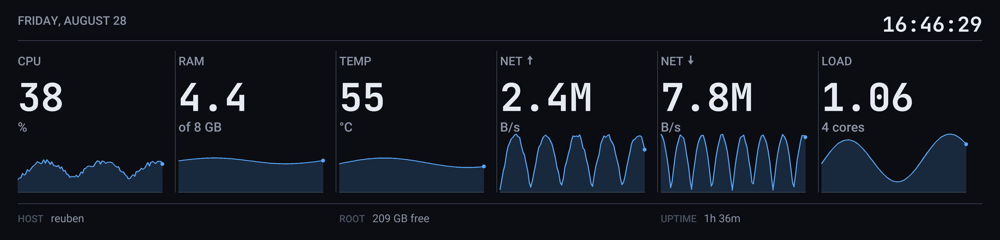
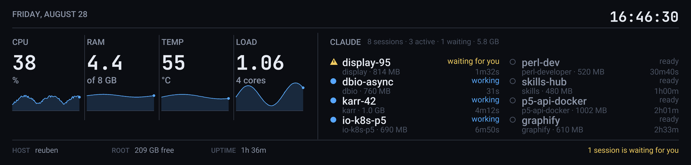

<div align="center">

# tzmrit-display

**Your PC case display on Linux — as a system monitor, and as a view of your running Claude sessions.**

For the **TZMRIT 9.16"** and compatible HONGTAI panels, which otherwise only a Windows application can drive.

</div>



Six values, each with its recent history. Color appears only when something gets out of hand.



With `--claude` the strip splits: the machine on the left, your running Claude Code
sessions on the right — who is working, who is waiting on you, and what each one
costs in memory. Up to **eight sessions** fit without truncation.

---

## Is this my device?

```bash
lsusb | grep 33c3
```

| | |
|---|---|
| **USB ID** | `33c3:7792` — reports as `HONGTAI MONITOR` |
| **Model** | `D215-NOR-FL7707N-9.16inch-hor` |
| **Resolution** | **1920 × 462** — not 1920 × 480 as advertised |
| **Connection** | USB CDC-ACM → `/dev/ttyACM0` |
| **Kernel driver** | none needed, `cdc_acm` handles it |

Related panels in the same family (such as `33c3:7791`, 480 × 480) should work too —
the geometry is **queried** from the device, not assumed.

## Installation

```bash
git clone https://github.com/Getty/tzmrit-display.git
cd tzmrit-display
python3 -m venv .venv
./.venv/bin/pip install -e .
```

Access to `/dev/ttyACM0` requires the `dialout` group:

```bash
sudo usermod -aG dialout "$USER"     # then log out and back in once
```

If that is not enough on your system, a udev rule ships with the project:

```bash
sudo cp systemd/99-hongtai-panel.rules /etc/udev/rules.d/
sudo udevadm control --reload && sudo udevadm trigger
```

## Usage

```bash
display-panel run --claude       # system metrics + Claude sessions
display-panel run                # metrics only, six columns instead of four
display-panel info               # what the device says about itself
display-panel preview -o out.png # render the layout without using the panel
display-panel image picture.png  # show any image
display-panel brightness 60      # 0–100
display-panel clear              # clear the panel
```

`preview` is the fast path for layout work: it needs no hardware and does not
hold the port, so you can iterate on the design while the monitor keeps running.
`--claude` works there too.

## Running it permanently

The panel only shows something **while a process sends keepalives** — with no
program running, the screen goes black. Hence a service:

```bash
mkdir -p ~/.config/systemd/user
cp systemd/display-panel.service ~/.config/systemd/user/
systemctl --user daemon-reload
systemctl --user enable --now display-panel
```

While the service runs it owns the port — stop it before running commands by hand:
`systemctl --user stop display-panel`.

### If the service says `Permission denied` but it works interactively

If `dialout` was granted after you logged in, the `systemd --user` instance does
not know about it yet: it starts at login and keeps its groups until the next one.
`daemon-reload` changes nothing, because the groups come from PAM.

```bash
id -Gn                                                            # your shell
grep ^Groups /proc/$(pgrep -u "$USER" -f "systemd --user" | head -1)/status
```

If the GID for `dialout` (usually 20) is missing there, **log out and back in once**.
Until then, start it directly:

```bash
setsid nohup ./.venv/bin/python -m display_panel run --claude </dev/null >/tmp/panel.log 2>&1 &
```

## What `--claude` shows — and what it does not

It reads `~/.claude/sessions/<pid>.json`, where Claude Code keeps the status of
every running session current. No API, no login.

| State | Rendering |
|---|---|
| `requires_action` | warning triangle, yellow, **"waiting for you"** — always sorted first |
| `busy` | filled dot, blue, "working" + duration |
| `idle` | hollow circle, dimmed, "ready" + duration |

Sorting is by urgency, not alphabetical: whatever waits on you comes first. Up to
four sessions are set in one column, beyond that in two — so **eight** fit without
truncation. Only from the ninth does a "+N more" row appear.

### Memory

Below each name sits the project and its **memory — including the MCP servers**
that hang off the session as child processes. That is not a detail: measured on a
real session, Claude itself accounts for 493 MB and 814 MB with its five MCP
servers. Counting only the main process understates the footprint by roughly 40 %.
The header carries the total across all sessions.

Sampling happens every four seconds rather than every frame; a full walk across
two sessions with 28 child processes costs about 9 ms, 0.3 ms from cache.

**Not visible:** sessions on other machines (Remote Control goes through the cloud
bridge, not a local file) and subagents *inside* a session — those live in the same
process.

## On the design

The columns have **no** individual colors. Their identity comes from position and
label; one color per column would be decoration carrying no information. Color
appears only when a threshold is crossed — and never alone, always with a warning
triangle beside it, so it still reads without color perception.

Green is deliberately absent: a dashboard where everything glows green in normal
operation burns attention on information that never changes. Quiet is the
default state.

Thresholds live in `display_panel/sources.py`, colors and metrics in
`display_panel/theme.py`.

## Layout

```
display_panel/
  panel.py            wire protocol: frames, keepalive, rotation, JPEG
  render.py           layout engine for 1920 × 462
  sources.py          system metrics with history
  claude_sessions.py  running Claude sessions
  theme.py            colors, fonts, metrics
  cli.py              command line
docs/protocol.md      the protocol as measured against the device
```

## Tests

```bash
./.venv/bin/python -m pytest
```

## License

MIT — see [LICENSE](LICENSE).

Bundled fonts keep their own licenses: Roboto (Apache 2.0) in
`fonts/roboto/LICENSE.txt`, JetBrains Mono (OFL) in `fonts/jetbrains-mono/OFL.txt`.
