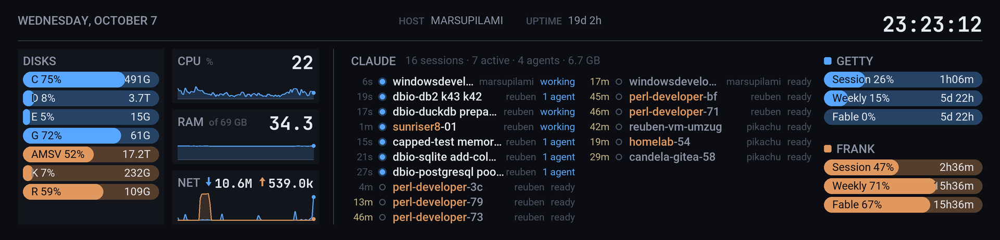
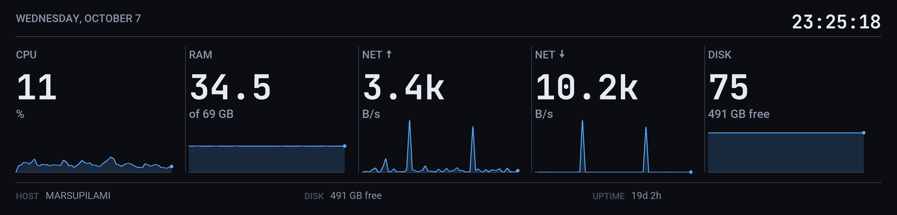
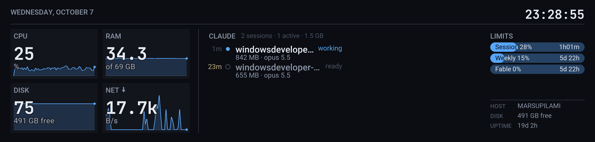

<div align="center">

# tzmrit-display

**Your PC case display on Linux and Windows — a system monitor, and a status board for the Claude Code sessions of all your machines.**

For the **TZMRIT 9.16"** and compatible HONGTAI panels, which otherwise only the vendor's Windows application can drive.

</div>



**The board** (`--board`, or as soon as you name other machines with `--hosts`):
every drive as a bar, CPU/RAM/NET, the Claude Code sessions of this machine and
of the others — read over ssh, nothing installed there — and the limits of every
Claude account involved. Above: one Windows PC, two Linux hosts, sixteen
sessions, two accounts. See
[Several machines on one panel](#several-machines-on-one-panel).

On Windows it is one download and one command:

```powershell
tzmrit-display service install --hosts reuben,pikachu
```

([installer](https://github.com/Getty/tzmrit-display/releases/latest), then
[Running it permanently](#running-it-permanently).)



**The system monitor** (`run`): six values, each with its recent history. Color
appears only when something gets out of hand.



**One machine's sessions** (`run --claude`): the strip splits into a left third
of four system metrics in 2×2 cards (the value sits over each graph) and the
right two thirds with two session lanes plus a utility column for Claude limits
and HOST/DISK/UPTIME. Up to **ten sessions** fit without truncation.

---

## Is this my device?

```bash
lsusb | grep 33c3
```

On Windows: open *Device Manager* → *Ports (COM & LPT)* and look for a
`USB Serial Device`, or just run `tzmrit-display info` after installing.

| | |
|---|---|
| **USB ID** | `33c3:7792` — reports as `HONGTAI MONITOR` |
| **Model** | `D215-NOR-FL7707N-9.16inch-hor` |
| **Resolution** | **1920 × 462** — not 1920 × 480 as advertised |
| **Connection** | USB CDC-ACM → `/dev/ttyACM0` |
| **Kernel driver** | none needed, `cdc_acm` handles it |

Related panels in the same family (such as `33c3:7791`, 480 × 480) should work too —
the geometry is **queried** from the device, not assumed.

## Installation

```bash
git clone https://github.com/Getty/tzmrit-display.git
cd tzmrit-display
python3 -m venv .venv
./.venv/bin/pip install -e .
```

Access to `/dev/ttyACM0` requires the `dialout` group:

```bash
sudo usermod -aG dialout "$USER"     # then log out and back in once
```

If that is not enough on your system, a udev rule ships with the project:

```bash
sudo cp systemd/99-hongtai-panel.rules /etc/udev/rules.d/
sudo udevadm control --reload && sudo udevadm trigger
```

## Windows

The protocol is just a serial port and JPEG frames, so nothing about it is
Linux specific — and the platform specific probes (load average, temperature
sensors, `/proc`) have been made portable. Windows binds the panel with its
built-in `usbser.sys`, so no driver install is needed. Close the vendor
application first — it holds the port exclusively.

### The installer

The easiest path: download `tzmrit-display-setup-<version>.exe` from the
[releases](https://github.com/Getty/tzmrit-display/releases) and run it. No
Python, no git, no admin rights — it installs per-user and registers an
uninstaller in *Apps & Features*. During setup you pick what starts
automatically when you log on: the system dashboard, the dashboard with
Claude sessions, or neither (untick both).

Afterwards the Start menu has a **TZMRIT Display** folder:

| Entry | What it does |
|---|---|
| **TZMRIT Display** | start the system dashboard |
| **TZMRIT Display (Claude sessions)** | start the split view with your Claude sessions |
| **TZMRIT Display (Board)** | start the board: drives, CPU/RAM/NET, sessions, limits |
| **Stop TZMRIT Display** | stop whichever dashboard is running |
| **Uninstall** | remove everything (also listed in *Apps & Features*) |

Two things you never have to manage yourself:

- **Switching views.** Only one dashboard drives the panel at a time. Starting
  one variant while the other is running replaces it — click the entry you
  want, done. No stopping first, no second process fighting over the port.
- **Plugging and unplugging.** If the panel is unplugged — or not yet plugged
  in when you log on — the dashboard waits quietly in the background and picks
  the panel up by itself a few seconds after it appears. No error dialogs, no
  restart needed.

The same stop control exists on the command line: `tzmrit-display stop`.
The installer is built with `packaging\build.bat` (needs NSIS).

### From a checkout

```powershell
git clone https://github.com/Getty/tzmrit-display.git
cd tzmrit-display
install.bat
```

`install.bat` sets up a virtualenv, verifies the panel answers, and puts an
autostart shortcut in the Startup folder; `uninstall.bat` reverses it.

Without a temperature sensor and load average (neither exists on Windows) the
layout shows five columns instead of six — the width adapts. Details and
verified-hardware notes: [docs/windows.md](docs/windows.md).

## Usage

```bash
tzmrit-display run --claude       # system metrics + Claude sessions
tzmrit-display run                # metrics only, six columns instead of four
tzmrit-display run --claude --http 8080   # also serve the same frame at :8080
tzmrit-display run --board        # drives, CPU/RAM/NET, sessions, limits
tzmrit-display run --hosts reuben,pikachu   # the board, plus those machines' sessions
tzmrit-display service install --hosts reuben,pikachu   # Windows: start at logon
tzmrit-display stop               # ask a running dashboard to exit cleanly
tzmrit-display info               # what the device says about itself
tzmrit-display preview -o out.png # render the layout without using the panel
tzmrit-display image picture.png  # show any image
tzmrit-display brightness 60      # 0–100
tzmrit-display clear              # clear the panel
```

`preview` is the fast path for layout work: it needs no hardware and does not
hold the port, so you can iterate on the design while the monitor keeps running.
`--claude`, `--board` and `--hosts` work there too. Both `run` and `preview` accept `--theme {blue,red}`;
blue is the default. `--theme red` switches the normal accent to red, and the
working marker follows the selected accent rather than staying blue.

## Several machines on one panel

```bash
tzmrit-display run --hosts reuben,pikachu,frank=frank@lab.example.org
```

`--hosts` adds the Claude Code sessions of other machines to the list, each row
marked with its machine. A host is anything `ssh` accepts — an alias from
`~/.ssh/config` included — and `label=target` chooses the name on the panel.

**Nothing is installed on those machines.** The dashboard keeps one `ssh`
connection per host open and pipes a small stdlib-only probe into `python3` on
the other end, which reports the sessions every two seconds. What the host
needs is `python3` (3.6 or newer) and a key-based login that works without a
prompt: `ssh -o BatchMode=yes <host> true` must succeed. A host that stops
answering is named as `offline` in the header and retried every five seconds;
its sessions leave the list rather than freezing in their last state.

The board is laid out for this:

| Area | What it shows |
|---|---|
| **Header** | date, host and uptime, clock |
| **DISKS** | one bar per drive with percent used and free space. Local drives in the accent color, network drives in the warm one. Drive letters mapped to the same share are one bar (`AMSV`); empty card readers and optical drives are left out |
| **CPU / RAM / NET** | NET draws download and upload as two curves on a shared scale |
| **Sessions** | all machines, most urgent first. Up to ten in two-line rows; from the eleventh on the rows go to one line each and twenty fit |
| **Limits** | one titled block per Claude account |

**More than one account.** If a host is logged in to a different Claude account
than this machine, the board shows that account's limits as a second block
under its own name and in its own color. The usage is read *on that host* with
that host's credentials; only the percentages travel back, the token never
leaves the machine. Hosts on your own account add no block.

**Subagents.** A session whose subagents are at work reads `3 agents` instead
of `working`, and the header carries the total. An agent counts while its
transcript was written to in the last two minutes — an estimate: one stuck in
a long tool call drops out of the count until it writes again.

**Limits that cannot be renewed stay.** When the usage endpoint does not answer
(it rate-limits at times) or a host is offline, the last reading is kept and
drawn faded, with its age beside the title (`25m old`), instead of vanishing.
This machine's last reading is also kept on disk, so a restarted dashboard has
bars at once rather than only after its first successful fetch.

### A hosts file

`--hosts-file FILE` reads the machines from a text file, one per line, `#` for
comments. The running dashboard follows the file: add or remove a line and the
connections change within a second, no restart.

```
# ~/.config/tzmrit-display/hosts.txt
reuben
pikachu
frank=frank@lab.example.org
```

## View it in a browser (`--http`)

`run --http PORT` serves the **exact same rendered frame** that goes to the panel
over HTTP: open `http://<host>:PORT/` for a page that refreshes ~1×/s, or fetch
`/frame.png` for the current frame. It runs alongside the panel, so you can watch
the dashboard from another machine.

```bash
tzmrit-display run --claude --http 8080              # panel + web on :8080
tzmrit-display run --claude --http 8080 --no-panel   # web only, no panel needed
```

`--no-panel` is the headless web dashboard — it composes and serves frames with
no device attached (it requires `--http`).

> **Exposure:** the default bind is `0.0.0.0`, so the page is reachable from any
> machine that can reach the port, and it shows your system metrics and Claude
> session names/projects. Restrict it to this machine with
> `--http-host 127.0.0.1`.

## Running it permanently

The panel only shows something **while a process sends keepalives** — with no
program running, the screen goes black.

### Windows

```powershell
tzmrit-display service install --hosts reuben,pikachu --http 8765 --http-host 127.0.0.1
```

registers a logon task that starts the board, restarts it after a crash, and
needs no admin rights. `service status`, `start`, `stop`, `restart` and
`uninstall` do what they say. The hosts land in
`%APPDATA%\tzmrit-display\hosts.txt` — edit that file to change them, the
running dashboard follows it. Leave `--hosts` out to keep the file as it is.
The log is `%LOCALAPPDATA%\tzmrit-display\dashboard.log`. Why this is a logon
task and not an entry in the Services console: [docs/windows.md](docs/windows.md).

With the installer the program is not on `PATH`; run it as
`"%LOCALAPPDATA%\Programs\tzmrit-display\tzmrit-display.exe" service install ...`.

For the plain views the installer's autostart choice (or `install.bat`'s
Startup shortcut) does the same job; `service install` replaces that shortcut.

### Linux

```bash
mkdir -p ~/.config/systemd/user
cp systemd/tzmrit-display.service ~/.config/systemd/user/
systemctl --user daemon-reload
systemctl --user enable --now tzmrit-display
```

While the service runs it owns the port — stop it before running commands by hand:
`systemctl --user stop tzmrit-display`.

For the board, change `ExecStart` in the unit to
`... run --hosts-file %h/.config/tzmrit-display/hosts.txt`.

### If the service says `Permission denied` but it works interactively

If `dialout` was granted after you logged in, the `systemd --user` instance does
not know about it yet: it starts at login and keeps its groups until the next one.
`daemon-reload` changes nothing, because the groups come from PAM.

```bash
id -Gn                                                            # your shell
grep ^Groups /proc/$(pgrep -u "$USER" -f "systemd --user" | head -1)/status
```

If the GID for `dialout` (usually 20) is missing there, **log out and back in once**.
Until then, start it directly:

```bash
setsid nohup ./.venv/bin/python -m tzmrit_display run --claude </dev/null >/tmp/panel.log 2>&1 &
```

## What `--claude` shows — and what it does not

It reads `~/.claude/sessions/<pid>.json`, where Claude Code keeps the status of
every running session current. No API, no login.

| State | Rendering |
|---|---|
| `requires_action` / `waiting` | warning triangle, yellow, **"waiting for you"** — always sorted first |
| `busy` | with fresh transcript activity, or while no transcript timestamp is available: a subtly pulsing filled marker with a visible core in the selected accent, "working"; with a known stale timestamp, it falls back to a static hollow circle, dimmed, "ready" + time since last activity |
| `idle` | hollow static circle, dimmed, "ready" + time since last activity |

Sorting is by urgency, not alphabetical: whatever waits on you comes first. Two
session lanes hold five rows each, so **ten** sessions fit without truncation. A
`+N more` row appears only from the eleventh.

### Memory

Below each name, the session sub-line shows its memory — including the MCP
servers that hang off the session as child processes — and, when available, the
model of the most recently resolved assistant turn. When a session name is
derived from its project and there is enough room, that project appears as a
tinted prefix in the name instead of being repeated below. For very long names,
the whole name may instead be truncated without tint. That is not a detail:
measured on a real session, Claude itself accounts for 493 MB and 814 MB with its
five MCP servers. Counting only the main process understates the footprint by
roughly 40 %. The header carries the total across all sessions.

Sampling happens every four seconds rather than every frame; a full walk across
two sessions with 28 child processes costs about 9 ms, 0.3 ms from cache.

Sessions on other machines are not in these files — name the machines with
`--hosts` to have them read over ssh. Subagents live inside their session's
process and get no row of their own; a session shows how many are at work.

## On the design

The columns have **no** individual colors. Their identity comes from position and
label; one color per column would be decoration carrying no information. Color
appears only when a threshold is crossed — and never alone, always with a warning
triangle beside it, so it still reads without color perception.

Green is deliberately absent: a dashboard where everything glows green in normal
operation burns attention on information that never changes. Quiet is the
default state.

Thresholds live in `tzmrit_display/sources.py`, colors and metrics in
`tzmrit_display/theme.py`.

## Layout

```
tzmrit_display/
  panel.py            wire protocol: frames, keepalive, rotation, JPEG
  render.py           layout engine for 1920 × 462
  sources.py          system metrics with history
  claude_sessions.py  running Claude sessions
  claude_limits.py    account usage windows
  remote_hosts.py     sessions of other machines, one ssh connection each
  remote_probe.py     what runs on the other end (stdlib only, piped in)
  service.py          Windows autostart task
  theme.py            colors, fonts, metrics
  cli.py              command line
docs/protocol.md      the protocol as measured against the device
```

## Tests

```bash
./.venv/bin/python -m pytest
```

## License

MIT — see [LICENSE](LICENSE).

Bundled fonts keep their own licenses: Roboto (Apache 2.0) in
`tzmrit_display/fonts/roboto/LICENSE.txt`, JetBrains Mono (OFL) in
`tzmrit_display/fonts/jetbrains-mono/OFL.txt`.
